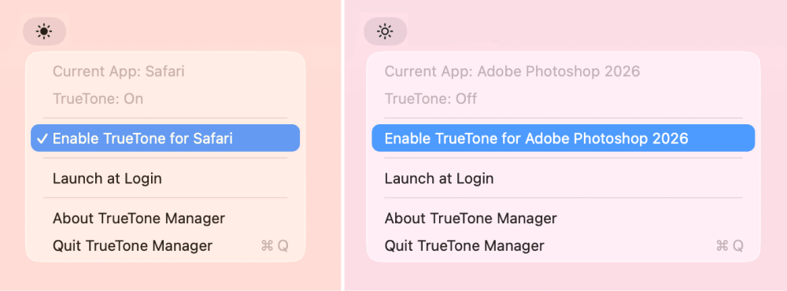

# TrueTone Manager



## Preface from a real, living human

I’m a designer, and I think every designer, photographer, or anyone working with color on an Apple computer knows one crucial thing: you must never forget to turn off True Tone. It subtly shifts the display’s color balance depending on the ambient lighting in the room.

In practice, this mode can completely ruin color grading work. There are plenty of horror stories online about people having to redo entire projects after accidentally working with True Tone enabled.

At the same time, outside of work, it can actually be quite pleasant. It reduces eye strain and makes the display feel warmer and more comfortable. That’s exactly what this app is for: it automatically switches True Tone depending on which application is currently in focus.

I hope this app turns out useful for you. I’ve wanted something like this for a long time but could never find it. Now, in the glorious age of LLMs, there’s no need to  search - I just ended up building it myself. Now I can watch how AI destroys my career with TrueTone off, yay!

Alright, you bag of bolts, go ahead and write the README:

## Description

TrueTone Manager automatically toggles macOS True Tone per application. A lightweight menu bar app that remembers your True Tone preference for each app and applies it on switch.

## Features

- **Per-app rules** — set each app to **Always On**, **Always Off**, or **Use Default**. The rule is applied automatically when that app comes to the foreground.
- **Configurable default** — the baseline state for apps without a rule. Captured from your current system setting on first launch (no assumptions baked in) and changeable any time from the menu. Leaving an app that had a rule restores the default.
- **Multi-display aware** — True Tone is a system-wide setting, but only some displays support it. The app detects whether a True Tone-capable display is active and shows **Unavailable** instead of failing — e.g. a MacBook in clamshell mode driving a third-party monitor.
- **Menu bar icon** — shows the current True Tone status at a glance.
- **Persistent preferences** — per-app rules saved to disk and restored on relaunch.
- **Launch at Login** — optional auto-start via `SMAppService`.
- **No Dock icon** — runs silently as a menu bar accessory.

## Requirements

- macOS 13 (Ventura) or later
- Apple Silicon Mac (`arm64`)

## Installation

### Homebrew (recommended)

Installs directly to `/Applications` and clears quarantine automatically:

```bash
brew tap mrtnby/tap https://github.com/martinrusetski/true-tone-manager
brew trust mrtnby/tap 
brew install --cask mrtnby/tap/true-tone-manager
```

### DMG (pre-built)

Grab the latest `.dmg` from the [Releases](https://github.com/martinrusetski/true-tone-manager/releases) page, open it, and drag the app to `/Applications`.

> **Note:** The DMG build is ad-hoc signed but not notarized. macOS may block it on first launch. Remove quarantine with:
> ```bash
> xattr -cr /Applications/TrueTone\ Manager.app
> ```
> Then open normally. Alternatively, go to **System Settings → Privacy & Security** and click **Open Anyway**.

## Usage

1. Launch the app — a ☀️ icon appears in your menu bar.
2. Click the icon. The menu shows the current app and the current True Tone state.
3. Under **TrueTone for (current app)**, choose **Always On**, **Always Off**, or **Use Default**.
4. Set the fallback for every other app under **Default (apps without a rule)**.
5. Switch apps — TrueTone Manager applies the matching rule automatically, and restores the default when you leave an app that had one.

## How It Works

TrueTone Manager monitors app switches via `NSWorkspace` and toggles True Tone through Apple's private `CBTrueToneClient` (CoreBrightness) — the same system-wide switch as the System Settings checkbox. True Tone applies to every capable display at once; it is not controlled per-display.

To know whether True Tone can be changed at any given moment, the app checks display capability via `DisplayServices` (True Tone is ambient-light white-point compensation). If no capable display is active — for example a laptop running closed-lid on an external monitor without a True Tone sensor — the menu shows **Unavailable** and rules are deferred until a capable display returns.

Preferences are stored as JSON in:

```
~/Library/Application Support/TrueToneManager/preferences.json
```

## License

[MIT](LICENSE)
