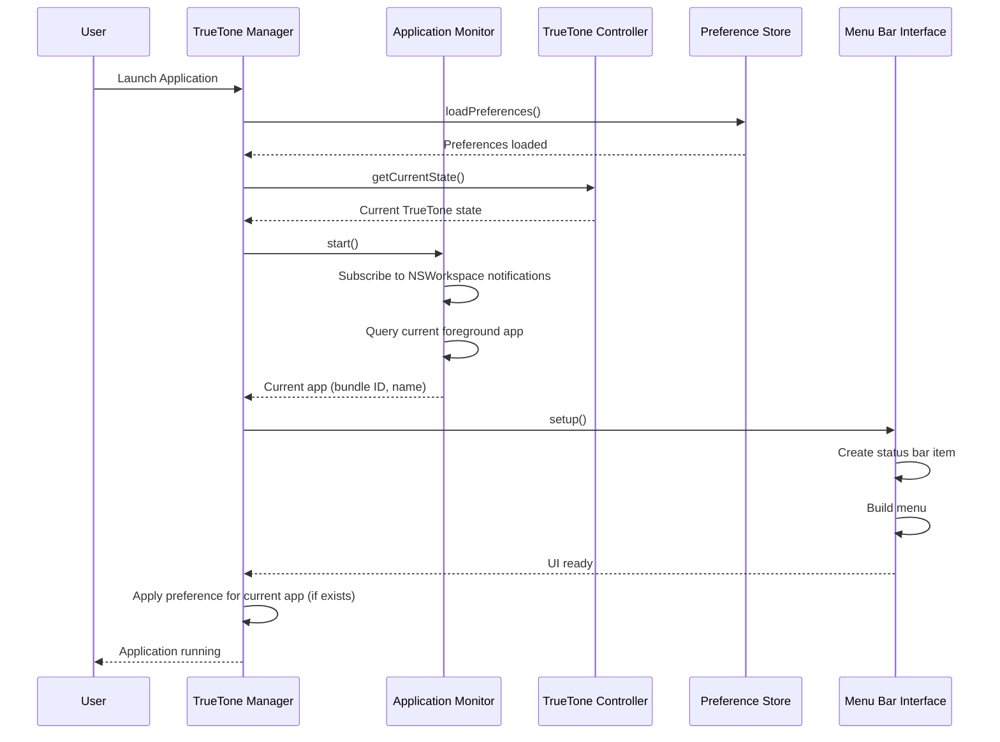
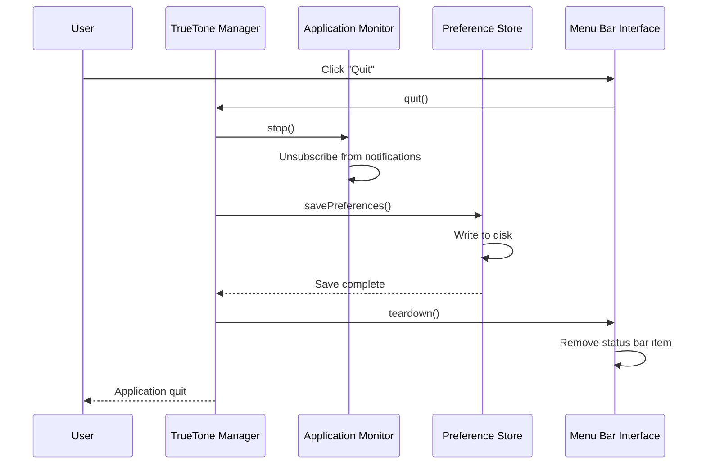
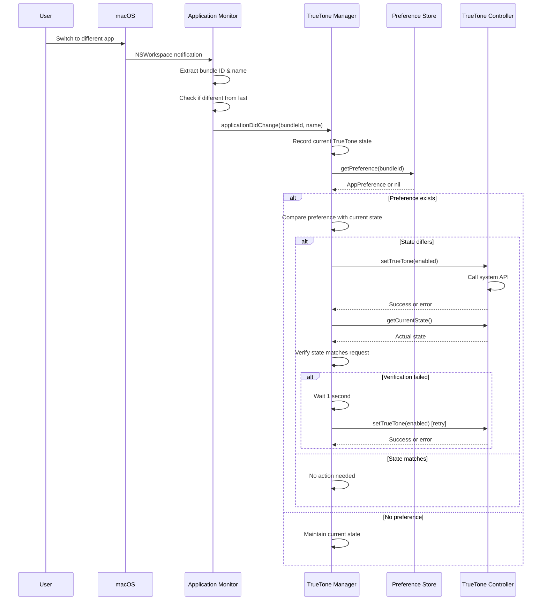
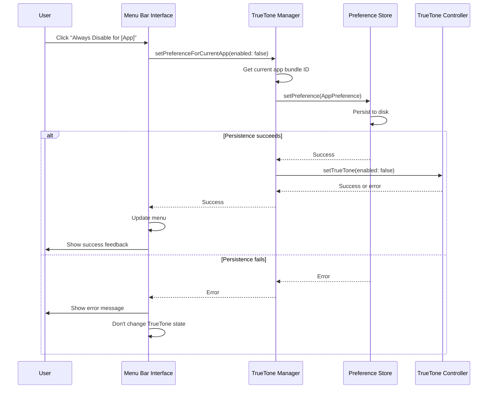
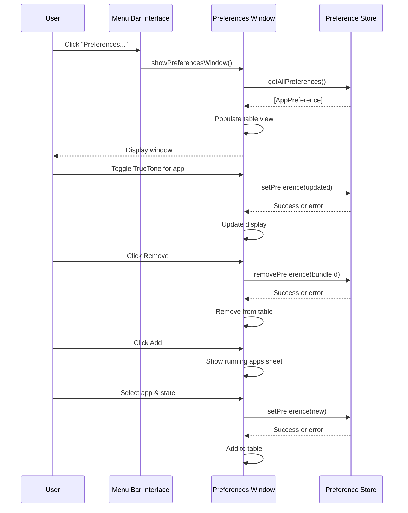

# Technical Design Document

## Overview

The TrueTone Manager is a native macOS menu bar application built with Swift and AppKit that automatically manages the system's TrueTone display functionality based on the currently active foreground application. The application provides a lightweight, always-running service that monitors application switches and applies user-configured TrueTone preferences without requiring manual intervention.

### Key Design Goals

1. **Minimal Performance Impact**: Use efficient polling and caching to minimize CPU usage
2. **Responsive UI**: All user interactions complete within specified time constraints
3. **Reliable State Management**: Ensure TrueTone state changes are applied correctly and verified
4. **Robust Error Handling**: Gracefully handle permission issues, hardware limitations, and API failures
5. **Native macOS Integration**: Leverage system APIs and follow macOS design patterns

### Technology Stack

- **Language**: Swift 5.9+
- **UI Framework**: AppKit (NSStatusBar, NSMenu, NSWindow)
- **Application Monitoring**: NSWorkspace.shared.notificationCenter
- **TrueTone Control**: CoreBrightness framework (private API) or IOKit
- **Persistence**: UserDefaults or JSON file storage
- **Build System**: Xcode with Swift Package Manager for dependencies

### Research Findings

**Application Monitoring**: macOS provides `NSWorkspace` notifications for application activation events. The `NSWorkspace.didActivateApplicationNotification` notification fires when the foreground application changes, providing the `NSRunningApplication` object with bundle identifier and display name.

**TrueTone Control**: TrueTone control requires accessing private frameworks (CoreBrightness) or using IOKit to communicate with display services. The application will need to:
- Use `CBBlueLightClient` from CoreBrightness (private framework) for TrueTone control
- Alternatively, use IOKit's `IODisplayConnect` APIs
- Handle cases where TrueTone is unavailable (older hardware, external displays)

**Permissions**: macOS Catalina+ requires accessibility permissions for some system-level operations. The app may need to request Screen Recording or Accessibility permissions depending on the API approach.

**Launch at Login**: Use `SMLoginItemSetEnabled` from ServiceManagement framework (deprecated in macOS 13+) or the newer `SMAppService` API for macOS 13+.

## Architecture

### Component Overview

The application follows a layered architecture with clear separation of concerns:

```
┌─────────────────────────────────────────────────────────┐
│                    Menu Bar Interface                    │
│              (NSStatusBar + NSMenu + NSWindow)           │
└─────────────────────────────────────────────────────────┘
                            │
                            ▼
┌─────────────────────────────────────────────────────────┐
│                   TrueTone Manager                       │
│            (Coordination & Business Logic)               │
└─────────────────────────────────────────────────────────┘
          │                  │                  │
          ▼                  ▼                  ▼
┌──────────────────┐ ┌──────────────┐ ┌─────────────────┐
│ Application      │ │  TrueTone    │ │  Preference     │
│ Monitor          │ │  Controller  │ │  Store          │
└──────────────────┘ └──────────────┘ └─────────────────┘
          │                  │                  │
          ▼                  ▼                  ▼
┌──────────────────┐ ┌──────────────┐ ┌─────────────────┐
│  NSWorkspace     │ │ CoreBrightness│ │  FileManager    │
│  Notifications   │ │  / IOKit     │ │  + JSON         │
└──────────────────┘ └──────────────┘ └─────────────────┘
```

### Design Patterns

1. **Observer Pattern**: Application monitoring uses NSWorkspace notifications
2. **Repository Pattern**: Preference Store abstracts persistence details
3. **Facade Pattern**: TrueTone Controller provides simple interface to complex system APIs
4. **Singleton Pattern**: TrueTone Manager coordinates all components as a single instance
5. **Delegate Pattern**: Components notify the manager of state changes

## Components and Interfaces

### 1. Application Monitor

**Responsibility**: Detect when the foreground application changes and notify the TrueTone Manager.

**Interface**:

```swift
protocol ApplicationMonitorDelegate: AnyObject {
    func applicationDidChange(bundleIdentifier: String, displayName: String)
    func applicationMonitoringFailed(error: ApplicationMonitorError)
}

class ApplicationMonitor {
    weak var delegate: ApplicationMonitorDelegate?
    
    func start() throws
    func stop()
    func getCurrentApplication() -> (bundleIdentifier: String, displayName: String)?
}

enum ApplicationMonitorError: Error {
    case workspaceUnavailable
    case bundleIdentifierUnavailable
    case permissionDenied
}
```

**Implementation Details**:

- Subscribe to `NSWorkspace.didActivateApplicationNotification` on initialization
- Extract `bundleIdentifier` and `localizedName` from `NSRunningApplication`
- Notification fires immediately when foreground app changes (no polling needed for detection)
- Use a 100ms debounce timer to prevent rapid-fire notifications during app switching
- Cache the last reported bundle identifier to avoid duplicate notifications
- On startup, query `NSWorkspace.shared.frontmostApplication` to get current app

**Performance Considerations**:
- Notifications are event-driven (no CPU cost when idle)
- Debounce timer prevents excessive processing during rapid app switches
- String comparison for duplicate detection is O(1) with cached values

### 2. TrueTone Controller

**Responsibility**: Enable and disable TrueTone on the primary display.

**Interface**:

```swift
protocol TrueToneControllerDelegate: AnyObject {
    func trueToneStateDidChange(enabled: Bool)
}

class TrueToneController {
    weak var delegate: TrueToneControllerDelegate?
    
    func getCurrentState() throws -> Bool
    func setTrueTone(enabled: Bool) throws
    func isSupported() -> Bool
}

enum TrueToneControllerError: Error {
    case unsupportedHardware
    case permissionDenied(requiredPermission: String)
    case systemAPIError(underlyingError: Error)
    case stateVerificationFailed
}
```

**Implementation Details**:

**Option 1: CoreBrightness Framework (Preferred)**
- Link against `/System/Library/PrivateFrameworks/CoreBrightness.framework`
- Use `CBBlueLightClient` class (private API)
- Methods: `getBlueLightStatus()` and `setBlueLightEnabled(_:)`
- Note: Private API usage may require disabling library validation

**Option 2: IOKit Display Services**
- Use `IOServiceGetMatchingServices` to find display services
- Query/set display properties via `IODisplayCopyIntegerDefault`
- More stable but requires more complex setup

**State Management**:
- Cache current TrueTone state to avoid unnecessary system calls
- Verify state after changes by re-querying system
- Implement retry logic with exponential backoff for transient failures

**Error Handling**:
- Detect unsupported hardware by checking for TrueTone capability
- Map system error codes to meaningful error messages
- Provide actionable guidance for permission issues

### 3. Preference Store

**Responsibility**: Persist and retrieve application-specific TrueTone preferences.

**Interface**:

```swift
struct AppPreference: Codable, Equatable {
    let bundleIdentifier: String
    let trueToneEnabled: Bool
    let displayName: String
    let dateModified: Date
}

protocol PreferenceStoreDelegate: AnyObject {
    func preferencesDidChange()
}

class PreferenceStore {
    weak var delegate: PreferenceStoreDelegate?
    
    func loadPreferences() throws
    func savePreferences() throws
    
    func getPreference(for bundleIdentifier: String) -> AppPreference?
    func getAllPreferences() -> [AppPreference]
    
    func setPreference(_ preference: AppPreference) throws
    func removePreference(for bundleIdentifier: String) throws
}

enum PreferenceStoreError: Error {
    case invalidBundleIdentifier
    case fileReadError(underlyingError: Error)
    case fileWriteError(underlyingError: Error)
    case corruptedData
}
```

**Implementation Details**:

**Storage Format**: JSON file at `~/Library/Application Support/TrueToneManager/preferences.json`

```json
{
  "version": 1,
  "preferences": [
    {
      "bundleIdentifier": "com.adobe.Photoshop",
      "trueToneEnabled": false,
      "displayName": "Adobe Photoshop",
      "dateModified": "2024-01-15T10:30:00Z"
    }
  ]
}
```

**Persistence Strategy**:
- Load all preferences into memory on app launch
- Maintain in-memory dictionary keyed by bundle identifier for O(1) lookup
- Write to disk immediately after each modification (no batching)
- Use atomic file writes to prevent corruption
- Create backup before writing, restore on corruption detection

**Data Validation**:
- Reject empty or null bundle identifiers
- Validate JSON schema on load
- If corruption detected, rename corrupted file and start fresh

**Performance**:
- In-memory cache ensures <50ms lookup time
- Async file I/O to avoid blocking main thread
- Typical file size: <10KB for 100 preferences

### 4. TrueTone Manager (Coordinator)

**Responsibility**: Coordinate all components and implement business logic for automatic TrueTone adjustment.

**Interface**:

```swift
class TrueToneManager {
    static let shared = TrueToneManager()
    
    private let applicationMonitor: ApplicationMonitor
    private let trueToneController: TrueToneController
    private let preferenceStore: PreferenceStore
    
    func start() throws
    func stop()
    
    func handleApplicationChange(bundleIdentifier: String)
    func setPreferenceForCurrentApp(enabled: Bool) throws
    func removePreferenceForCurrentApp() throws
    
    var currentApplication: (bundleIdentifier: String, displayName: String)? { get }
    var currentTrueToneState: Bool { get }
}
```

**Business Logic**:

1. **Application Change Handling**:
   ```
   When application changes:
   1. Query preference store for bundle identifier
   2. If preference exists:
      a. Check if current TrueTone state matches preference
      b. If different, request state change from controller
      c. Verify state change succeeded
      d. If verification fails, retry once after 1 second
   3. If no preference exists:
      a. Take no action (maintain current state)
   4. Log all state transitions for debugging
   ```

2. **State Verification**:
   - After requesting state change, query controller for current state
   - Compare requested vs actual state
   - If mismatch, treat as failure and trigger retry logic

3. **Retry Logic**:
   - Single retry after 1 second delay
   - No further retries to avoid infinite loops
   - Log failure for user troubleshooting

4. **Error Handling**:
   - Catch all errors from components
   - Determine if error is transient (retry) or permanent (notify user)
   - Limit notifications to once per error type per session

### 5. Menu Bar Interface

**Responsibility**: Provide user interface for status display and preference management.

**Components**:

**A. Status Bar Item (NSStatusItem)**
- Icon: SF Symbol "sun.max" or custom icon
- Always visible in menu bar
- Click to show menu

**B. Main Menu (NSMenu)**

Menu structure:
```
┌─────────────────────────────────────────┐
│ Current App: [Application Name]        │
│ TrueTone: [On/Off]                      │
├─────────────────────────────────────────┤
│ ☐ Always Enable for [App]              │  (or)
│ ☐ Always Disable for [App]             │  (or)
│ ☐ Remove Preference for [App]          │
├─────────────────────────────────────────┤
│ Preferences...                          │
│ ✓ Launch at Login                       │
├─────────────────────────────────────────┤
│ Quit TrueTone Manager                   │
└─────────────────────────────────────────┤
```

**Interface**:

```swift
class MenuBarInterface: NSObject {
    private var statusItem: NSStatusItem?
    private var menu: NSMenu
    private let manager: TrueToneManager
    
    func setup()
    func updateMenu()
    func showPreferencesWindow()
    func showNotification(title: String, message: String, type: NotificationType)
}

enum NotificationType {
    case error
    case success
    case info
}
```

**Implementation Details**:

- Create status item with `NSStatusBar.system.statusItem(withLength: NSStatusItem.variableLength)`
- Update menu items dynamically based on current application and preferences
- Use `NSMenu.update()` to refresh menu before display
- Truncate long app names to 27 characters + "..."
- Disable menu items during async operations to prevent double-clicks

**C. Preferences Window (NSWindow)**

Window layout:
```
┌────────────────────────────────────────────────┐
│  TrueTone Manager Preferences                  │
├────────────────────────────────────────────────┤
│                                                │
│  Application Preferences:                      │
│                                                │
│  ┌──────────────────────────────────────────┐ │
│  │ Adobe Photoshop        [Off] [Remove]    │ │
│  │ Final Cut Pro          [Off] [Remove]    │ │
│  │ Safari                 [On]  [Remove]    │ │
│  │                                          │ │
│  └──────────────────────────────────────────┘ │
│                                                │
│  [+ Add Running Application]                   │
│                                                │
│  No preferences configured.                    │  (if empty)
│                                                │
└────────────────────────────────────────────────┘
```

**Interface**:

```swift
class PreferencesWindowController: NSWindowController {
    private var tableView: NSTableView
    private var preferences: [AppPreference]
    
    func reloadData()
    func showAddApplicationSheet()
}
```

**Implementation Details**:

- Use `NSTableView` with custom cell views
- Toggle switches use `NSSwitch` control
- Remove buttons use `NSButton` with destructive style
- Add application sheet shows list of running apps from `NSWorkspace.shared.runningApplications`
- Filter out system apps and apps without bundle identifiers
- Real-time updates when preferences change

## Data Models

### AppPreference

```swift
struct AppPreference: Codable, Equatable {
    let bundleIdentifier: String
    let trueToneEnabled: Bool
    let displayName: String
    let dateModified: Date
    
    init(bundleIdentifier: String, trueToneEnabled: Bool, displayName: String) {
        guard !bundleIdentifier.isEmpty else {
            fatalError("Bundle identifier cannot be empty")
        }
        self.bundleIdentifier = bundleIdentifier
        self.trueToneEnabled = trueToneEnabled
        self.displayName = displayName
        self.dateModified = Date()
    }
}
```

### PreferenceCollection

```swift
struct PreferenceCollection: Codable {
    let version: Int
    var preferences: [AppPreference]
    
    static let currentVersion = 1
    
    init() {
        self.version = PreferenceCollection.currentVersion
        self.preferences = []
    }
}
```

### TrueToneState

```swift
enum TrueToneState {
    case enabled
    case disabled
    case unknown
    
    var boolValue: Bool? {
        switch self {
        case .enabled: return true
        case .disabled: return false
        case .unknown: return nil
        }
    }
}
```

## Correctness Properties

*A property is a characteristic or behavior that should hold true across all valid executions of a system—essentially, a formal statement about what the system should do. Properties serve as the bridge between human-readable specifications and machine-verifiable correctness guarantees.*

### Property 1: Application Change Notification Correctness

*For any* application change event with a valid bundle identifier, the Application Monitor SHALL notify the TrueTone Manager with the correct bundle identifier extracted from the event.

**Validates: Requirements 1.2**

### Property 2: Application Monitoring Error Handling

*For any* application change event where the system API fails, the Application Monitor SHALL attempt to extract the bundle identifier if available, otherwise SHALL notify with an error indication.

**Validates: Requirements 1.6**

### Property 3: TrueTone State Transitions

*For any* requested TrueTone state (enabled or disabled), when the current state differs from the requested state, the TrueTone Controller SHALL transition to the requested state and return success.

**Validates: Requirements 2.1, 2.2, 2.6**

### Property 4: TrueTone Control Idempotence

*For any* TrueTone state (enabled or disabled), requesting that same state when already in that state SHALL return success without modifying the state (f(x) = f(f(x))).

**Validates: Requirements 2.3, 2.4**

### Property 5: System Error Propagation

*For any* system API error encountered during TrueTone control, the TrueTone Controller SHALL return an error message that includes the underlying API error details.

**Validates: Requirements 2.9**

### Property 6: Preference Upsert

*For any* valid App_Preference (non-empty bundle identifier), adding the preference SHALL persist it such that subsequent queries return the preference with matching bundle identifier and TrueTone state. If a preference already exists for that bundle identifier, it SHALL be replaced.

**Validates: Requirements 3.1, 3.2, 3.4**

### Property 7: Preference Deletion

*For any* App_Preference that exists in the store, removing it SHALL result in subsequent queries for that bundle identifier returning null or empty result.

**Validates: Requirements 3.3**

### Property 8: Preference Storage Error Handling

*For any* preference operation (add, remove, update) that fails due to storage errors, the Preference Store SHALL return an error message indicating the failure reason.

**Validates: Requirements 3.5**

### Property 9: Automatic TrueTone Adjustment

*For any* application change where an App_Preference exists for that application, the TrueTone Manager SHALL apply the TrueTone state specified in the preference (enabled or disabled).

**Validates: Requirements 4.1, 4.2**

### Property 10: No-Change Optimization

*For any* application change where an App_Preference exists and the current TrueTone state already matches the preference, the TrueTone Manager SHALL not request a state change from the controller.

**Validates: Requirements 4.3**

### Property 11: Maintain State Without Preference

*For any* application change where no App_Preference exists for that application, the TrueTone Manager SHALL maintain the current TrueTone state without modification.

**Validates: Requirements 4.4**

### Property 12: Storage Failure Handling

*For any* application change where the Preference Store fails to return a preference, the TrueTone Manager SHALL maintain the current TrueTone state and log the error.

**Validates: Requirements 4.7**

### Property 13: State Recording Before Changes

*For any* application change that triggers a TrueTone state adjustment, the TrueTone Manager SHALL record the current TrueTone state before applying any changes.

**Validates: Requirements 4.10**

### Property 14: Application Name Display

*For any* foreground application with a display name, the Menu Bar Interface SHALL display that application's name in the menu.

**Validates: Requirements 5.3**

### Property 15: Name Truncation

*For any* application display name exceeding 30 characters, the Menu Bar Interface SHALL truncate it to exactly 27 characters and append "..." (resulting in exactly 30 characters total).

**Validates: Requirements 5.4**

### Property 16: Menu Item Logic Based on State

*For any* combination of (current application has preference: yes/no) and (current TrueTone state: on/off), the Menu Bar Interface SHALL display the appropriate menu item: "Always Enable" when no preference and TrueTone off, "Always Disable" when no preference and TrueTone on, or "Remove Preference" when preference exists.

**Validates: Requirements 5.6, 5.7, 5.8**

### Property 17: Preference List Display

*For any* collection of App_Preferences, the preferences window SHALL display all preferences with each showing the application display name and TrueTone state (enabled or disabled).

**Validates: Requirements 6.2, 6.3**

### Property 18: Preference Toggle

*For any* App_Preference displayed in the preferences window, toggling its TrueTone state SHALL flip the state (enabled ↔ disabled) and persist the change.

**Validates: Requirements 6.4**

### Property 19: Preference Removal from UI

*For any* App_Preference displayed in the preferences window, clicking the remove button SHALL delete the preference from the store.

**Validates: Requirements 6.5**

### Property 20: Preference Addition from UI

*For any* running application selected from the add application list, adding it as a preference SHALL persist the preference with the selected TrueTone state.

**Validates: Requirements 6.7**

### Property 21: UI Error Handling

*For any* preference modification that fails to persist, the Menu Bar Interface SHALL display an error message to the user.

**Validates: Requirements 6.9**

### Property 22: Quick Toggle Preference Creation

*For any* current application without an existing preference, selecting the quick toggle menu item SHALL create an App_Preference with the selected TrueTone state (enabled or disabled) and apply that state.

**Validates: Requirements 7.4, 7.5**

### Property 23: Quick Toggle Error Handling

*For any* quick toggle operation where persisting the preference fails, the Menu Bar Interface SHALL display an error message and SHALL not change the TrueTone state.

**Validates: Requirements 7.7**

### Property 24: Error Notification Deduplication

*For any* error type, multiple occurrences of that error during a single application session SHALL produce at most one notification to the user.

**Validates: Requirements 9.4**

### Property 25: Preference Persistence Round-Trip

*For any* valid collection of App_Preferences, saving the collection to persistent storage and then loading it SHALL produce a collection with equivalent application bundle identifiers and TrueTone states for all preferences.

**Validates: Requirements 10.7**

## Error Handling

### Error Categories

1. **Permission Errors**: Insufficient permissions to control TrueTone or access system APIs
2. **Hardware Errors**: TrueTone not supported on current hardware
3. **System API Errors**: Failures from macOS frameworks (CoreBrightness, IOKit, NSWorkspace)
4. **Storage Errors**: File I/O failures when reading/writing preferences
5. **Validation Errors**: Invalid input data (empty bundle identifiers, corrupted preference files)

### Error Handling Strategy

**Detection and Classification**:
- Catch all errors at component boundaries
- Map system error codes to application error types
- Include underlying error details for debugging

**User Notification**:
- Display user-friendly error messages via NSUserNotification
- Provide actionable guidance (e.g., "Grant Screen Recording permission in System Preferences > Privacy")
- Limit notifications to once per error type per session (deduplication)
- Auto-dismiss notifications after 10 seconds

**Logging**:
- Log all errors with timestamp, component, and error details
- Use os_log for system integration
- Log levels: .error for failures, .info for state changes, .debug for detailed flow

**Recovery**:
- Retry transient failures (API timeouts, temporary file locks)
- Single retry with 1-second delay for TrueTone control failures
- Exponential backoff for application monitoring failures (5s, 10s, 20s)
- Graceful degradation: continue running even if TrueTone control fails

**State Consistency**:
- Never leave system in inconsistent state
- Verify state changes after applying them
- Roll back preference changes if persistence fails
- Maintain current TrueTone state if preference lookup fails

### Error Messages

**Permission Error**:
```
Title: "TrueTone Manager Needs Permission"
Message: "Please grant Screen Recording permission in System Preferences > Security & Privacy > Privacy to allow TrueTone control."
```

**Hardware Error**:
```
Title: "TrueTone Not Supported"
Message: "Your Mac does not support TrueTone. This feature requires a True Tone display."
```

**Storage Error**:
```
Title: "Failed to Save Preferences"
Message: "Your preferences could not be saved. They may be lost when the application quits."
```

## Testing Strategy

### Testing Approach

The TrueTone Manager requires a dual testing approach combining property-based testing for core logic with example-based testing for specific scenarios and integration testing for system interactions.

### Property-Based Testing

**Framework**: Use Swift's native testing framework with a property-based testing library such as:
- **SwiftCheck** (most mature, similar to QuickCheck)
- **swift-check** (modern Swift implementation)

**Configuration**:
- Minimum 100 iterations per property test
- Each test tagged with: `Feature: truetone-manager, Property {number}: {property_text}`
- Use custom generators for domain types (AppPreference, TrueToneState, etc.)

**Test Organization**:
```
Tests/
├── PropertyTests/
│   ├── ApplicationMonitorPropertyTests.swift
│   ├── TrueToneControllerPropertyTests.swift
│   ├── PreferenceStorePropertyTests.swift
│   ├── TrueToneManagerPropertyTests.swift
│   └── MenuBarInterfacePropertyTests.swift
├── UnitTests/
│   ├── ApplicationMonitorTests.swift
│   ├── TrueToneControllerTests.swift
│   ├── PreferenceStoreTests.swift
│   └── MenuBarInterfaceTests.swift
├── IntegrationTests/
│   ├── EndToEndTests.swift
│   └── PerformanceTests.swift
└── Generators/
    ├── AppPreferenceGenerator.swift
    ├── BundleIdentifierGenerator.swift
    └── TrueToneStateGenerator.swift
```

**Custom Generators**:

```swift
// Generator for valid bundle identifiers
extension String: Arbitrary {
    static func arbitraryBundleIdentifier() -> Gen<String> {
        let components = Gen.fromElements(of: ["com", "org", "io"])
        let vendor = Gen.fromElements(of: ["apple", "adobe", "microsoft", "google"])
        let app = Gen.fromElements(of: ["Safari", "Photoshop", "Word", "Chrome"])
        return Gen.compose { c, v, a in "\(c).\(v).\(a)" } <^> components <*> vendor <*> app
    }
}

// Generator for AppPreference
extension AppPreference: Arbitrary {
    static var arbitrary: Gen<AppPreference> {
        return Gen.compose { bundleId, enabled, name in
            AppPreference(
                bundleIdentifier: bundleId,
                trueToneEnabled: enabled,
                displayName: name
            )
        } <^> String.arbitraryBundleIdentifier()
          <*> Bool.arbitrary
          <*> String.arbitrary
    }
}

// Generator for preference collections
extension Array: Arbitrary where Element == AppPreference {
    static var arbitrary: Gen<[AppPreference]> {
        return Gen.sized { size in
            Gen.sequence(Array(repeating: AppPreference.arbitrary, count: size))
        }
    }
}
```

**Example Property Test**:

```swift
// Feature: truetone-manager, Property 25: Preference Persistence Round-Trip
func testPreferencePersistenceRoundTrip() {
    property("For any valid preference collection, save then load preserves data") <- forAll { (preferences: [AppPreference]) in
        // Arrange
        let store = PreferenceStore()
        
        // Act
        for pref in preferences {
            try? store.setPreference(pref)
        }
        try? store.savePreferences()
        
        let newStore = PreferenceStore()
        try? newStore.loadPreferences()
        let loaded = newStore.getAllPreferences()
        
        // Assert
        return Set(preferences.map { $0.bundleIdentifier }) == 
               Set(loaded.map { $0.bundleIdentifier }) &&
               preferences.allSatisfy { pref in
                   loaded.first { $0.bundleIdentifier == pref.bundleIdentifier }?.trueToneEnabled == pref.trueToneEnabled
               }
    }
}
```

### Unit Testing

**Purpose**: Test specific examples, edge cases, and error conditions not covered by property tests.

**Coverage**:
- Error message content (permission errors, hardware errors)
- Retry logic (single retry after failure)
- Notification deduplication (first error shown, subsequent suppressed)
- UI state rendering (checkmarks, menu items)
- Initialization behavior (query state on startup)
- Empty state handling (no preferences configured)

**Example Unit Test**:

```swift
func testPermissionErrorMessage() {
    // Arrange
    let controller = TrueToneController()
    mockSystemAPI.shouldFailWithPermissionError = true
    
    // Act
    let result = try? controller.setTrueTone(enabled: true)
    
    // Assert
    XCTAssertNil(result)
    XCTAssertEqual(controller.lastError, .permissionDenied(requiredPermission: "Screen Recording"))
}
```

### Integration Testing

**Purpose**: Test system interactions, timing requirements, and end-to-end workflows.

**Coverage**:
- Application monitoring latency (<500ms detection)
- TrueTone control latency (<200ms state change)
- Preference load time (<500ms on startup)
- Menu display time (<200ms on click)
- Launch at login registration
- Notification display and dismissal

**Mocking Strategy**:
- Mock CoreBrightness/IOKit for TrueTone control
- Mock NSWorkspace for application monitoring
- Mock FileManager for preference storage
- Use dependency injection to swap real implementations with mocks

**Example Integration Test**:

```swift
func testEndToEndApplicationSwitch() {
    // Arrange
    let manager = TrueToneManager.shared
    let photoshopPref = AppPreference(
        bundleIdentifier: "com.adobe.Photoshop",
        trueToneEnabled: false,
        displayName: "Adobe Photoshop"
    )
    try? manager.preferenceStore.setPreference(photoshopPref)
    
    // Act
    mockWorkspace.simulateAppSwitch(to: "com.adobe.Photoshop")
    
    // Wait for async processing
    let expectation = XCTestExpectation(description: "TrueTone state changed")
    DispatchQueue.main.asyncAfter(deadline: .now() + 0.6) {
        expectation.fulfill()
    }
    wait(for: [expectation], timeout: 1.0)
    
    // Assert
    XCTAssertFalse(manager.currentTrueToneState)
}
```

### Performance Testing

**Benchmarks**:
- Application change detection: <500ms
- TrueTone state change: <200ms
- Preference lookup: <50ms
- Preference load on startup: <500ms
- Menu display: <200ms

**Tools**:
- XCTest performance measurement APIs
- Instruments for profiling
- Manual testing with large preference collections (100+ apps)

### Test Coverage Goals

- **Property Tests**: 25 properties covering core business logic
- **Unit Tests**: 50+ tests covering edge cases and error conditions
- **Integration Tests**: 20+ tests covering system interactions
- **Code Coverage**: >80% line coverage, >90% for business logic

### Continuous Integration

- Run all tests on every commit
- Property tests run with 100 iterations in CI
- Integration tests run against mocked system APIs
- Performance tests run nightly with alerts for regressions


## Implementation Details

### Application Lifecycle

**Startup Sequence**:



**Shutdown Sequence**:



### Application Switch Flow



### Quick Toggle Flow



### Preference Window Flow



### File Structure

```
TrueToneManager/
├── TrueToneManager/
│   ├── App/
│   │   ├── AppDelegate.swift              # Application entry point
│   │   └── Info.plist                     # App configuration
│   ├── Core/
│   │   ├── TrueToneManager.swift          # Main coordinator
│   │   ├── ApplicationMonitor.swift       # App change detection
│   │   ├── TrueToneController.swift       # TrueTone control
│   │   └── PreferenceStore.swift          # Preference persistence
│   ├── Models/
│   │   ├── AppPreference.swift            # Preference data model
│   │   ├── PreferenceCollection.swift     # Collection wrapper
│   │   └── TrueToneState.swift            # State enum
│   ├── UI/
│   │   ├── MenuBarInterface.swift         # Status bar & menu
│   │   ├── PreferencesWindowController.swift
│   │   ├── PreferencesWindow.xib
│   │   └── AddApplicationSheet.swift
│   ├── Utilities/
│   │   ├── Logger.swift                   # Logging wrapper
│   │   ├── NotificationManager.swift      # User notifications
│   │   └── LaunchAtLoginManager.swift     # Login item management
│   └── Resources/
│       ├── Assets.xcassets                # Icons and images
│       └── Localizable.strings            # Localized strings
├── Tests/
│   ├── PropertyTests/
│   ├── UnitTests/
│   ├── IntegrationTests/
│   └── Generators/
├── TrueToneManager.xcodeproj
└── Package.swift                          # Swift Package Manager
```

### Key Implementation Considerations

**1. Private Framework Usage**

CoreBrightness is a private framework. To use it:

```swift
// Create bridging header
#import <CoreBrightness/CoreBrightness.h>

// Or use runtime loading
let framework = dlopen("/System/Library/PrivateFrameworks/CoreBrightness.framework/CoreBrightness", RTLD_NOW)
```

**Risks**:
- Private APIs may change between macOS versions
- App Store distribution not possible with private frameworks
- Requires disabling library validation

**Mitigation**:
- Implement fallback using IOKit if CoreBrightness unavailable
- Version detection to handle API changes
- Distribute outside App Store (direct download, Homebrew)

**2. Permissions**

macOS Catalina+ may require permissions:

```swift
// Check for Screen Recording permission
func checkScreenRecordingPermission() -> Bool {
    if #available(macOS 10.15, *) {
        let stream = CGDisplayStream(
            display: CGMainDisplayID(),
            outputWidth: 1,
            outputHeight: 1,
            pixelFormat: Int32(kCVPixelFormatType_32BGRA),
            properties: nil,
            queue: .main
        ) { _, _, _, _ in }
        return stream != nil
    }
    return true
}
```

**3. Launch at Login**

Use modern API for macOS 13+:

```swift
import ServiceManagement

func enableLaunchAtLogin() throws {
    if #available(macOS 13.0, *) {
        try SMAppService.mainApp.register()
    } else {
        // Use SMLoginItemSetEnabled for older macOS
        let success = SMLoginItemSetEnabled("com.truetonemanager.helper" as CFString, true)
        if !success {
            throw LaunchAtLoginError.registrationFailed
        }
    }
}
```

**4. Debouncing Application Changes**

Prevent rapid-fire notifications:

```swift
class ApplicationMonitor {
    private var debounceTimer: Timer?
    private var pendingBundleId: String?
    
    func handleWorkspaceNotification(_ notification: Notification) {
        guard let app = notification.userInfo?[NSWorkspace.applicationUserInfoKey] as? NSRunningApplication,
              let bundleId = app.bundleIdentifier else {
            return
        }
        
        // Cancel existing timer
        debounceTimer?.invalidate()
        
        // Store pending change
        pendingBundleId = bundleId
        
        // Set new timer
        debounceTimer = Timer.scheduledTimer(withTimeInterval: 0.1, repeats: false) { [weak self] _ in
            self?.notifyDelegate(bundleId: bundleId, name: app.localizedName ?? "Unknown")
        }
    }
}
```

**5. Atomic File Writes**

Prevent preference corruption:

```swift
func savePreferences() throws {
    let data = try JSONEncoder().encode(preferenceCollection)
    let tempURL = preferencesURL.appendingPathExtension("tmp")
    let backupURL = preferencesURL.appendingPathExtension("backup")
    
    // Write to temp file
    try data.write(to: tempURL, options: .atomic)
    
    // Backup existing file
    if FileManager.default.fileExists(atPath: preferencesURL.path) {
        try? FileManager.default.removeItem(at: backupURL)
        try? FileManager.default.moveItem(at: preferencesURL, to: backupURL)
    }
    
    // Move temp to final location
    try FileManager.default.moveItem(at: tempURL, to: preferencesURL)
}
```

**6. State Verification**

Ensure state changes succeed:

```swift
func setTrueTone(enabled: Bool) throws {
    // Request state change
    try systemAPI.setTrueTone(enabled)
    
    // Verify change
    let actualState = try getCurrentState()
    guard actualState == enabled else {
        throw TrueToneControllerError.stateVerificationFailed
    }
    
    // Update cache
    cachedState = actualState
}
```

**7. Memory Management**

Use weak references to prevent retain cycles:

```swift
class TrueToneManager {
    private let applicationMonitor: ApplicationMonitor
    
    init() {
        applicationMonitor = ApplicationMonitor()
        applicationMonitor.delegate = self  // Delegate is weak
    }
}

protocol ApplicationMonitorDelegate: AnyObject {  // AnyObject enables weak
    func applicationDidChange(bundleIdentifier: String, displayName: String)
}
```

**8. Thread Safety**

Ensure thread-safe access to shared state:

```swift
class PreferenceStore {
    private let queue = DispatchQueue(label: "com.truetonemanager.preferences", attributes: .concurrent)
    private var preferences: [String: AppPreference] = [:]
    
    func getPreference(for bundleIdentifier: String) -> AppPreference? {
        return queue.sync {
            return preferences[bundleIdentifier]
        }
    }
    
    func setPreference(_ preference: AppPreference) throws {
        try queue.sync(flags: .barrier) {
            preferences[preference.bundleIdentifier] = preference
            try savePreferences()
        }
    }
}
```

## Security Considerations

### Privilege Requirements

- **TrueTone Control**: Requires access to system display settings (no special privileges on most Macs)
- **Application Monitoring**: Uses public NSWorkspace APIs (no special privileges)
- **Preference Storage**: Uses user's Application Support directory (standard file access)
- **Launch at Login**: Requires user approval via system dialog

### Data Privacy

- **No Network Access**: Application operates entirely offline
- **Local Storage Only**: Preferences stored locally in user's home directory
- **No Telemetry**: No data collection or analytics
- **No Keychain Access**: No sensitive credentials stored

### Sandboxing

**App Store Distribution**: Not feasible due to private framework usage

**Non-Sandboxed Distribution**:
- Notarize application for Gatekeeper approval
- Code sign with Developer ID certificate
- Distribute via direct download or Homebrew

### Input Validation

- Validate bundle identifiers (non-empty, reasonable length)
- Sanitize file paths to prevent directory traversal
- Validate JSON structure when loading preferences
- Limit preference collection size (max 1000 apps)

## Performance Optimization

### Caching Strategy

1. **TrueTone State Cache**: Cache current state to avoid repeated system queries
2. **Preference Lookup Cache**: In-memory dictionary for O(1) preference lookup
3. **Application Name Cache**: Cache display names to avoid repeated NSWorkspace queries

### Lazy Loading

- Load preferences on demand if startup time exceeds 500ms
- Defer UI initialization until first menu click
- Lazy load running applications list for add sheet

### Memory Footprint

**Expected Memory Usage**:
- Base application: ~10 MB
- Preferences (100 apps): ~50 KB
- UI components: ~5 MB
- Total: ~15 MB

**Optimization**:
- Release preferences window when closed
- Use weak references for delegates
- Avoid retaining large objects in closures

### CPU Usage

**Idle State**: <0.1% CPU (event-driven, no polling)
**Active State**: <1% CPU during application switches

**Optimization**:
- Use notifications instead of polling
- Debounce rapid application switches
- Batch preference updates

## Deployment

### Build Configuration

**Debug Build**:
- Enable all logging
- Include debug symbols
- Disable optimizations

**Release Build**:
- Strip debug symbols
- Enable Swift optimizations (-O)
- Disable library validation (for private frameworks)

### Distribution Methods

1. **Direct Download**: DMG with application bundle
2. **Homebrew Cask**: `brew install --cask truetone-manager`
3. **GitHub Releases**: Automated builds via GitHub Actions

### Installation Process

1. Download DMG or install via Homebrew
2. Move application to /Applications
3. Launch application
4. Grant permissions if prompted (Screen Recording)
5. Configure preferences

### Update Mechanism

**Manual Updates**:
- Check for updates via menu item
- Download new version from website
- Replace old version in /Applications

**Future Enhancement**:
- Implement Sparkle framework for automatic updates
- Check for updates on launch (optional)
- Download and install updates in background

## Maintenance and Monitoring

### Logging

**Log Levels**:
- `.error`: Failures that prevent functionality
- `.info`: State changes and important events
- `.debug`: Detailed flow for troubleshooting

**Log Locations**:
- Console.app: View logs via os_log
- File: Optional file logging to ~/Library/Logs/TrueToneManager/

**Example Logs**:
```
[INFO] Application changed: com.adobe.Photoshop (Adobe Photoshop)
[INFO] Applying preference: TrueTone disabled
[INFO] TrueTone state changed: enabled -> disabled
[ERROR] Failed to set TrueTone state: Permission denied
[DEBUG] Preference lookup: com.apple.Safari -> nil
```

### Metrics

**Key Metrics**:
- Application switch detection latency
- TrueTone state change latency
- Preference lookup time
- Error rate by type
- Memory usage over time

**Monitoring**:
- Log metrics to file for analysis
- Optional telemetry (opt-in only)
- Crash reporting via system CrashReporter

### Troubleshooting

**Common Issues**:

1. **TrueTone not changing**:
   - Check permissions (Screen Recording)
   - Verify hardware support
   - Check system logs for errors

2. **Preferences not persisting**:
   - Check file permissions on Application Support directory
   - Verify disk space available
   - Check for corrupted preference file

3. **High CPU usage**:
   - Check for rapid application switching
   - Verify debounce timer is working
   - Look for notification subscription leaks

**Debug Mode**:
- Launch with `--debug` flag for verbose logging
- Enable debug menu with hidden preference
- Export diagnostic report with logs and preferences

## Future Enhancements

### Potential Features

1. **Multiple Display Support**: Control TrueTone per display
2. **Time-Based Rules**: Enable/disable TrueTone based on time of day
3. **Ambient Light Integration**: Adjust based on ambient light sensor
4. **Keyboard Shortcuts**: Global hotkeys for quick toggle
5. **Menu Bar Icon Customization**: Choose from multiple icon styles
6. **Export/Import Preferences**: Share preferences between Macs
7. **Application Groups**: Group apps with same TrueTone preference
8. **Automatic Updates**: Sparkle framework integration
9. **Statistics**: Track TrueTone usage patterns
10. **Profiles**: Switch between different preference sets

### Technical Debt

- Replace private framework usage with public APIs (if Apple provides them)
- Migrate to SwiftUI for preferences window (when mature enough)
- Add comprehensive accessibility support
- Implement proper localization for multiple languages
- Add unit tests for UI components (currently integration-tested only)

## Conclusion

The TrueTone Manager design provides a robust, performant solution for automatic TrueTone management based on active applications. The architecture emphasizes:

- **Separation of concerns** through clear component boundaries
- **Reliability** through comprehensive error handling and state verification
- **Performance** through caching and event-driven design
- **Testability** through property-based testing and dependency injection
- **Maintainability** through clear interfaces and documentation

The design addresses all 10 requirements with 25 correctness properties that will be validated through property-based testing, ensuring the application behaves correctly across a wide range of inputs and scenarios.
